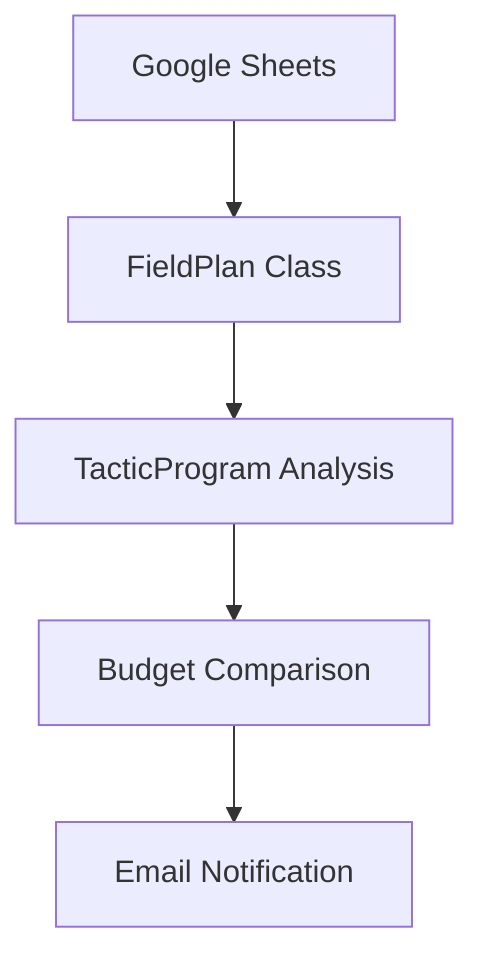

# Generate Project README

Create an accurate, well-structured README.md by reading the actual codebase.

## Context

If the user provides additional context: $ARGUMENTS

Use that context to identify the target project directory, specific sections to focus on, or details to include. If no context is provided, generate a README for the project root.

## Steps

### 1. Read the codebase

Gather facts — do not guess or use generic filler:

- **Directory structure**: `ls` the project root and key subdirectories to understand organization
- **Config files**: Read `package.json`, `pyproject.toml`, `.clasp.json`, `mkdocs.yml`, or equivalent for project name, description, dependencies, and scripts
- **Entry points**: Identify and read the main source files — classes, trigger functions, index files
- **Architecture patterns**: Note class hierarchies, config-driven patterns, shared constants, module boundaries
- **Git history**: `git log --oneline -20` for recent activity; `git log --oneline --all | tail -5` for project origin
- **Existing README**: If one exists, read it to preserve any manually-written context the code can't reveal (e.g., business context, team conventions)
- **Existing docs**: Check for `docs/`, `guides/`, or other documentation that provides context

### 2. Generate the README

Write `README.md` at the target directory with these sections. Only include sections that are relevant — skip empty or forced sections.

#### Header
```markdown
# Project Name

One-paragraph description of what this project does and why it exists.
```

The description should answer: What does this code do? Who is it for? What problem does it solve? Derive this from the code's actual behavior, not generic language.

#### Architecture Overview

- Component diagram showing how major parts connect (use Mermaid fenced blocks)
- Brief description of each component's responsibility
- Data flow: inputs, processing, outputs

Example:
````markdown

````

#### Project Structure

```
project-root/
  src/               — Source files (describe what's here)
  guides/            — Implementation guides
  docs/              — Published documentation
  ...
```

Only list directories and files that matter. Don't list every file — group by purpose.

#### Key Components

For each major class, module, or function group:
- Name and file location
- What it does (one sentence)
- Key methods or exports (if it's a public interface)

Derive this from reading the actual source files. Use the project's own names and terminology.

#### Getting Started

- Prerequisites (languages, tools, access)
- Setup steps (clone, install, configure)
- How to run locally
- How to deploy

Only include steps you can verify from the project's config files and scripts. If there's a `package.json` with scripts, reference them. If there's a `.clasp.json`, mention clasp. Don't invent steps.

#### Configuration

List environment variables, script properties, config files, or settings the project requires. Include:
- Name of each setting
- What it controls
- Where it's defined (file, service, environment)

Skip this section if configuration is trivial.

#### Documentation

Link to any additional documentation:
- `docs/` site (with URL if GitHub Pages is configured)
- `guides/` directory
- Related resources

#### Contributing / Development

- Branch strategy (derived from git branch names)
- Testing approach (if test files exist)
- Code conventions visible in the codebase

Only include this if there's evidence of a development workflow.

### 3. Handle existing README

- If a README already exists, read it first
- Preserve any manually-written context that can't be derived from code (business background, team decisions, links to external resources)
- Replace stale sections with accurate content from the codebase
- If starting fresh (user explicitly asked), generate entirely from code

### 4. Report results

Tell the user:
- What sections were generated and what source files informed them
- Any placeholders left where information couldn't be determined from code
- Whether an existing README was preserved, merged, or replaced

## Important rules

- Every technical claim must come from reading the actual source files — never assume
- Use the project's own terminology — if the code calls it `TacticProgram`, the README calls it `TacticProgram`
- Keep it concise — a README should be readable in 3-5 minutes
- Use Mermaid for diagrams (renders natively on GitHub)
- Don't include badges, shields, or decorative elements unless the user requests them
- Don't add a license section unless a LICENSE file exists
- If the project has sub-projects (e.g., multiple apps in a monorepo), note them and suggest per-directory READMEs
